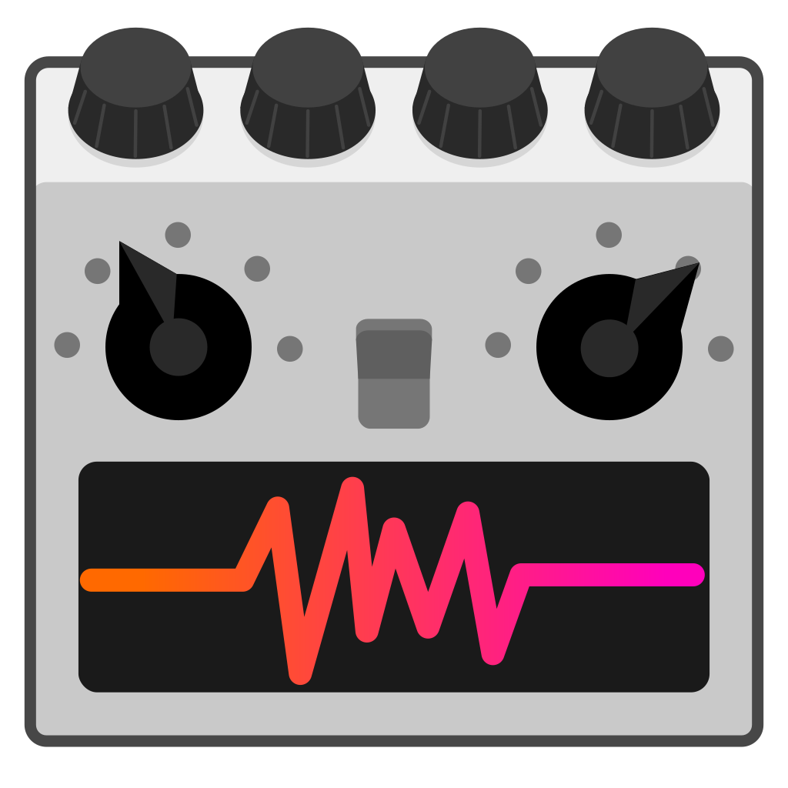

# Godot Sound Manager

A simple music and sound effect player for the [Godot Engine](https://godotengine.org/).

NOTE: This is for Godot 4. If you are using Godot 3 then have a look at the [v1.x branch](https://github.com/nathanhoad/godot_sound_manager/tree/v1.x).

 

## Features

- Pooled audio players
- Handles music crossfades
- Autodetect probable audio buses for both sounds and music
- Splits sounds up into UI sounds and local sounds
- Supports both GDScript and C#

## Installation

Copy the `addons/sound_manager` directory into your `res://addons/` directory.

Enable `SoundManager` in project plugins.

## Documentation

- [Sound effects](docs/Sounds.md)
- [Ambient sounds](docs/AmbientSounds.md)
- [Music](docs/Music.md)
- [C#](docs/CSharp.md)

## Contributors

Godot Sound Manager is made by [Nathan Hoad](https://nathanhoad.net) with help from [these cool people](https://github.com/nathanhoad/godot_sound_manager/graphs/contributors).

## License

Licensed under the MIT license, see `LICENSE` for more information.
